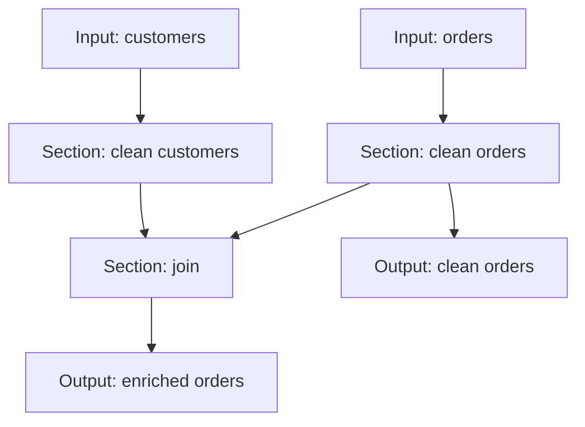

# DAG Architecture

> Status: design proposal for [MAN-31](https://linear.app/manuserp/issue/MAN-31/support-dag-pipelines-with-multiple-datasets-and-outputs).
>
> This document defines the intended concepts and compilation model. Public names and API syntax are provisional.

## Motivation

Today, `aquaflux_core` compiles a linear `Vec<Op>`. At execution time it accepts one Python DataFrame, converts it to one Polars `LazyFrame`, applies every operation in declaration order, and collects one final DataFrame.

That model is useful for a single transformation chain, but it cannot naturally express:

- multiple input datasets;
- independent transformation branches;
- a join between two datasets produced inside the same execution;
- reuse of an earlier lazy result;
- multiple requested outputs;
- dependency-aware introspection and debugging.

The target is a compiled DAG that keeps intermediate datasets lazy and crosses the Python ↔ Rust boundary only for required external inputs and requested outputs.

## Terminology

The names below are working terms and should be reviewed before they become public API.

| Level | Working name | Meaning |
|---|---|---|
| Atomic | **Operation** or **Instruction** | One low-level transformation such as select, filter, sort, or join. |
| Linear | **Section** | An ordered chain of operations with one primary input reference and one output reference. Operations may also consume auxiliary references, such as the right side of a join. |
| Graph | **ExecutionGraph** | A DAG of sections connected through dataset references. It defines dependencies and executable data flow. |
| Product | **Pipeline** | The user-facing Aquaflux object: an execution graph plus names, metadata, introspection, debug configuration, and output contract. |

`Junction` was considered for the graph-level object, but it may be confused with a join operation or a single convergence point. `ExecutionGraph` is clearer for now.

## Core abstraction: DatasetRef

A `DatasetRef` is a symbolic reference to a dataset, not the dataset itself.

A reference may resolve to:

1. an external Pandas or Polars DataFrame supplied to `execute`;
2. the lazy output produced by another section;
3. potentially, a loader or another input provider in a later design;
4. potentially, an explicitly materialized or cached dataset.

The graph should depend on the identity of the reference, not on how the referenced data is obtained.

Conceptually:

```text
DatasetRef("orders")           -> required external input
DatasetRef("orders_clean")     -> output of a section
DatasetRef("customers_clean")  -> output of another section and auxiliary input to JoinOp
```

Each reference must have exactly one producer within a compiled graph:

- an external input declaration; or
- one section output.

A reference cannot be both, and two sections cannot produce the same reference.

## Section

A section is the smallest independently schedulable pipeline unit. It preserves the current efficient model: an ordered chain of low-level operations applied to one primary `LazyFrame`.

A section contains:

- a stable name or identifier;
- one primary input `DatasetRef`;
- an ordered list of operations;
- zero or more auxiliary `DatasetRef` dependencies used by operations;
- exactly one output `DatasetRef`;
- optional logical metadata for introspection and debugging.

For example, a join section has a primary input reference for its left-hand dataset and an auxiliary reference for its right-hand dataset. `JoinOp.other` should eventually hold a reference rather than an eager Python DataFrame.

```python
# Illustrative API only
Section(
    name="join_orders_customers",
    input=ref("orders_clean"),
    operations=[
        JoinOp(
            other=ref("customers_clean"),
            left_on=["customer_id"],
            right_on=["id"],
            how="left",
        )
    ],
    output=ref("enriched_orders"),
)
```

Operations remain ordered inside a section. The compiler may order sections, but it must not silently reorder source-level operations inside a section. Polars may still optimize the resulting lazy plan.

## Execution graph

Sections form a dependency graph through their references.



Declaration order should not be semantically significant. Python callers should be able to declare sections in any order. Compilation builds the dependency graph and derives a valid topological execution order.

A graph is compilable when:

- every consumed reference has exactly one resolvable producer;
- every output reference exists;
- reference names are unique where uniqueness is required;
- the dependency graph is acyclic;
- every operation's auxiliary references are declared and resolvable;
- a topological ordering exists.

Forward references are therefore valid. A section may be declared before the section that produces one of its inputs, as long as the complete graph is valid.

Compilation must fail with clear errors for:

- unknown references;
- duplicate producers;
- cycles;
- missing requested outputs;
- invalid or ambiguous external input declarations;
- incompatible section or operation contracts that can be detected statically.

## Compilation model

The compiler should treat references as symbols and build a producer table.

A possible compilation sequence is:

1. Register every section output and reject duplicate producers.
2. Inspect every section's primary and auxiliary input references.
3. Classify references with no internal producer as required external inputs, subject to explicit input-declaration rules.
4. Validate requested output references.
5. Add an edge from each producing section to each consuming section.
6. detect cycles and compute a topological section order;
7. prune sections that are not needed for the requested outputs, if partial execution is supported;
8. produce a compiled input/output contract and an inspectable logical graph;
9. lower each required section to Polars lazy plans during execution.

The compiled object should expose at least:

- required external input reference names;
- requested output reference names;
- section names and their operations;
- reference producers and consumers;
- dependency edges;
- the compiler-selected topological order;
- logical metadata needed by introspection and debug tooling.

The compiler-generated input contract determines what `execute` requests. Users should not have to manually provide datasets that are never required by the requested outputs.

## Execution model

An illustrative execution API is:

```python
compiled = compile_pipeline(
    sections=[clean_customers, join_orders_customers, clean_orders],
    outputs=[ref("enriched_orders"), ref("orders_clean")],
)

compiled.required_inputs
# ("customers", "orders")

results = compiled.execute(
    customers=customers_df,
    orders=orders_df,
)

results["enriched_orders"]
results["orders_clean"]
```

The exact call and return shapes remain open. A mapping-based API may be easier to validate and extend than a generated Python function signature, while still exposing a precise compiled input contract.

At runtime:

1. validate that every required external input is present and no ambiguous input is supplied;
2. convert each required Pandas/Polars input to a Polars `LazyFrame` once;
3. store the lazy plan under its input reference;
4. execute sections in topological order;
5. resolve primary and auxiliary references from the lazy-reference store;
6. register each section's lazy output under its output reference;
7. collect only requested output references;
8. convert only collected outputs back through the Rust → Python boundary.

The logical graph and debug metadata must remain separate from Polars' optimized physical behavior. Normal execution should remain optimized; optional debug capture may introduce materialization and must make that cost explicit.

## Compatibility path

The current API should remain usable:

```python
compile_pipeline([op1, op2, op3]).execute(data)
```

It can be represented internally as:

- one implicit external input reference;
- one implicit section containing the operation chain;
- one implicit output reference.

This allows the DAG model to generalize the current linear pipeline rather than replacing it with an unrelated execution path.

The current eager `JoinOp.other` form may remain temporarily supported while a reference-based form is introduced.

## Notes and open questions

### Reference storage and LazyFrame lifetime

The implementation must define how compiled execution stores referenced `LazyFrame` plans.

Questions include:

- whether a `HashMap<DatasetRef, LazyFrame>` is sufficient;
- whether cloning a `LazyFrame` is the correct way to reuse a plan in multiple consumers;
- how long references remain live and when unused plans can be dropped;
- whether reference storage belongs to the compiled graph, an execution context, or both;
- how Rust ownership and borrowing should model primary and auxiliary consumers.

A reference means lazy reuse by default. It must not silently mean eager caching or materialization.

### Shared branches and multiple outputs

Collecting multiple outputs separately may recompute a shared branch. The design must investigate Polars behavior and decide whether to use common-subplan optimization, `collect_all`, explicit caching, or another mechanism.

Caching/materialization should be explicit and opt-in unless a safe optimizer-driven behavior is clearly defined.

### Input declaration

A referenced dataset with no internal producer could be inferred as an external input, but implicit inference may hide typos. Options include:

- require explicit external input declarations;
- infer inputs and expose them in the compiled contract;
- infer them but require compilation-time confirmation or strict validation.

Whatever approach is selected, compilation must deterministically report the DataFrames required by `execute`.

Future loaders should implement the same reference-resolution contract without forcing the graph to know loader-specific details.

### Output selection and partial execution

Only references designated as outputs should cross back into Python. If the caller requests a subset of declared outputs, the compiler or executor may prune unrelated sections.

The design must decide whether outputs are fixed at compile time, selected at execute time, or support both modes.

### Ordering and validation

Python declaration order should not matter. Aquaflux should perform topological sorting automatically.

"Referenced before it exists" should therefore mean that no valid producer exists in the complete graph, not merely that the producer appears later in the Python list.

Cycle and unknown-reference errors should include the relevant section and reference names.

### Operation dependencies

The current `LazyExecutable` trait accepts only one `LazyFrame`. Reference-aware operations such as `JoinOp` need a way to resolve auxiliary datasets without embedding Python DataFrames in operation objects.

Possible designs include:

- resolving all references before calling the operation;
- passing an execution/reference context;
- separating unary operations from multi-input operations;
- lowering reference-aware operations into a section plan during compilation.

This choice should preserve a simple path for ordinary unary operations.

### Introspection and debugging

The pipeline should expose the source-level graph independently of the optimized Polars plan. At minimum, introspection should include operation type, configuration, input/output references, dependency edges, and available schema metadata.

Per-section intermediate capture and graphical DAG generation remain opt-in debug features because they may add materialization, memory usage, or prevent some lazy optimizations.

### Naming

The hierarchy `Operation → Section → ExecutionGraph → Pipeline` is provisional.

In particular, alternatives for `Section` include `Stage`, `Chain`, `Block`, and `Transform`. The chosen term should communicate that this object is internally linear but participates as one node in a larger DAG.

## Initial implementation boundary

The first implementation should prove the core model with:

- multiple named Pandas/Polars inputs;
- sections with one primary input and one output;
- reference-based auxiliary input for `JoinOp`;
- automatic dependency resolution and topological sorting;
- unknown-reference, duplicate-producer, and cycle validation;
- multiple requested outputs;
- backward compatibility for a single linear pipeline;
- Rust and Python assertion-based tests.

Loaders, explicit materialization policies, advanced caching, dynamic outputs, and physical-plan scheduling can remain follow-up work unless required by the core design.
